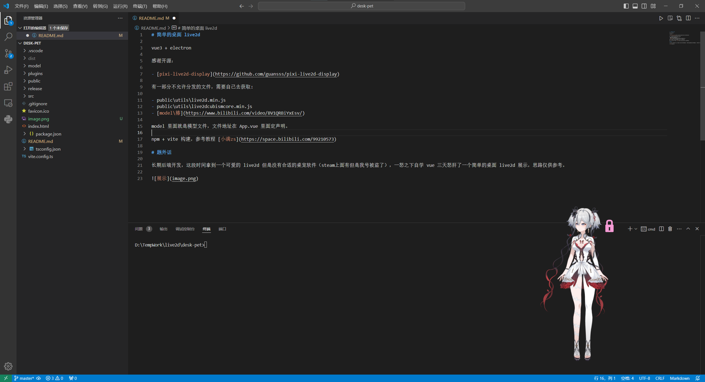

# 简单的桌面 live2d

vue3 + electron

感谢开源：

- [pixi-live2d-display](https://github.com/guansss/pixi-live2d-display)

有一部分不允许分发的文件，需要自己去获取:

这两个是 live2d 的核心运行时
- public\utils\live2d.min.js
- public\utils\live2dcubismcore.min.js

这个是模型文件
- [model\椿](https://www.bilibili.com/video/BV1QRBiYxEsv/)

model 里面就是模型文件，文件地址在 App.vue 里面定声明。

npm + vite 构建，参考教程 [小满zs](https://space.bilibili.com/99210573)

## 题外话

本人是后端开发，这段时间拿到一个可爱的 live2d 但是没有合适的桌宠软件（steam上面有但是我号被盗了），一怒之下自学 vue 三天怒肝了一个简单的桌面 live2d 展示，思路仅供参考。

